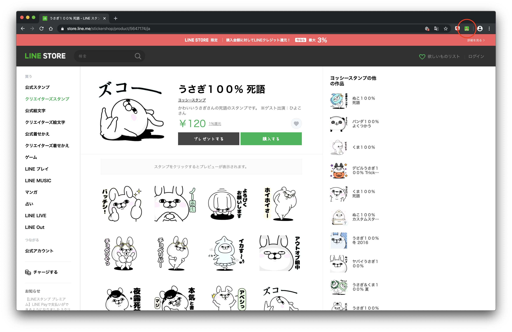
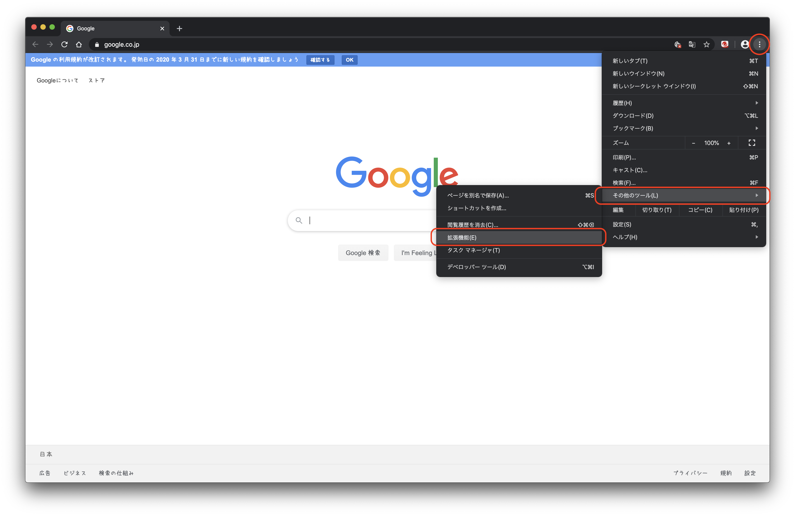
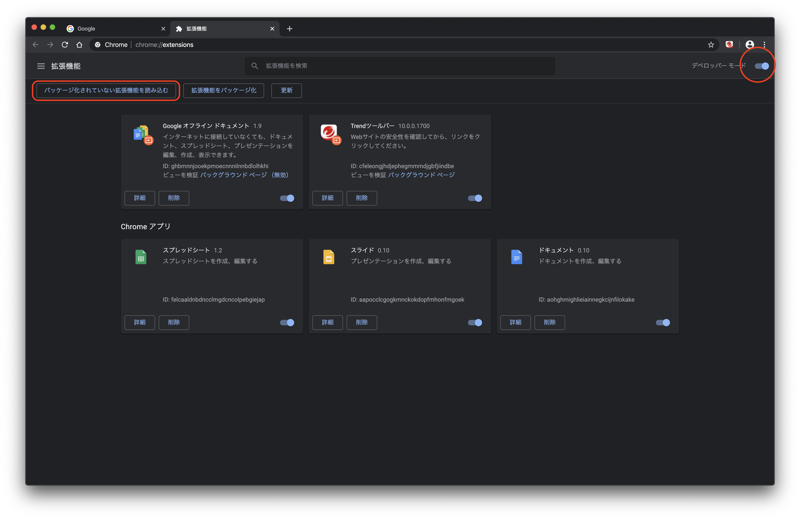
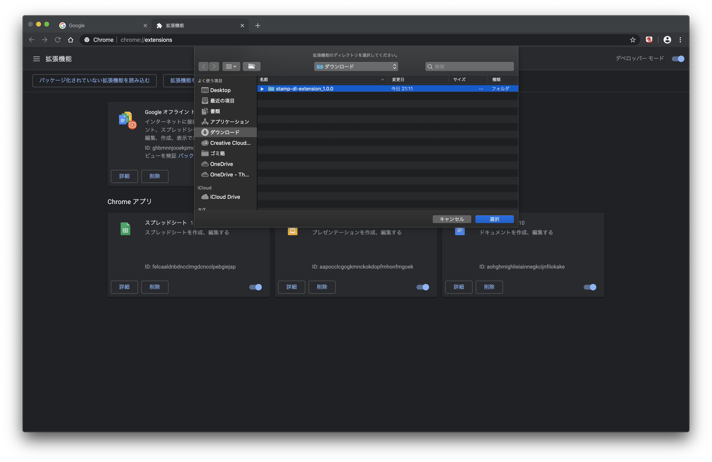

<h1 align="center">stamp-dl-extension</h1>

[LINE STORE](https://store.line.me/stickershop/home/general/jahttps://store.line.me/stickershop/home/general/ja) から LINE スタンプをダウンロードするため Chrome Extension

## Usage

ダウンロードしたいスタンプのページを開いてアイコンをクリック！

## Install

1. Chrome の拡張機能ページを開く
   
2. デベロッパーモードをオンにして、「パッケージ化されていない拡張機能を読み込む」ボタンを押す
   
3. リリースページからダウンロードした stamp-dl-extension のフォルダを選ぶ
   
